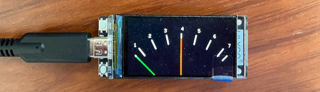

# An i2s Stereo PPM Display



A Peak Programme Meter (PPM) displays audio levels on a logarithmic scale numbered 1 to 7. It responds fast to peaks and returns slowly. The attack and return ballists allow an experienced operator to produce a consistent volume levels accros varrying material.

It is not a True Peak Meter, VU Meter or a modern Loudness Meter.  However, it has been in use for decades and is highly respected by many profession audio enginers. Invented by the BBC and evolved to the current specification emulated here.  It is identical in everyway to the EBU and SABC meters, except for the scale markings.  A VU meter is slow to respond to peaks and does not have a logrithmic scale. A True Peak Meter reponds to very short peaks, but does not measure volume. A Loudness Meter does what if says on the tin, but could be overkill for DATV.

NOTE: The above is a simplified summary to what is a very complicated subject.

## Current Status
All development takes place on the main branch, so it might be better to douwnload the latest release.

The firmware is fully working and the ballists are close to the IEC 60268-10 Type IIa specification. Of cource, there is room for improvement.

This version works in MASTER mode at 48kHz when connected to an Analogue to i2s Convertor. Other convertors, may also work.

SLAVE mode has not been investigated.

## TODO

- Implement MS mode using the -6dB standard. This will require an external switch connected to a GPIO line and I will need to convert my mono pre-amplifier to stereo.
- Test with Justin's USB-I2S and HDMI->I2S adapters.

## Hardware

LilyGo T-Display-S3R8 version H569 or H577 with 1.9 inch ST7789 LCD Display. Models H569/H577 do not have a touch screen and this is important.  The touch screen versions will not work!

Link: [LilyGo T-Display-S3R8](<https://www.lilygo.cc/products/t-display-s3?variant=42284559827125>)

Any "Standard/Philips" i2s input device, such as a TOSLINK, S/PDIF or Analogue to i2s convertor operating at 48kHz 16bit.

Example: [AudioPhonics Stereo ADC Board WM8782](<https://www.audiophonics.fr/en/devices-hifi-audio-adc/stereo-adc-board-wm8782-i2s-24bit-192khz-p-14897.html>)

## Pin Connections
The i2s specification omits to provide a standard for the bus names.

The AudioPhonics solder pads are labeled B, LR, D and CLK, as follows:
```
        alias           also known as
B       Bit clock       BCK, SCK, BCLK, etc.
LR      Word clock      WS, LRCLK, FS, etc.
D       Serial data     DATA, SD, SDATA, SDIN, SDOUT, DACDAT, ADCDAT, etc.
CLK     Master clock    MCK, etc. 
```

If using the AudioPhonics Board, connect as follows:
```
AudioPhonics pad B   to T-Display-S3R8 pin 12
AudioPhonics pad LR  to T-Display-S3R8 pin 11
AudioPhonics pad D   to T-Display-S3R8 pin 10
AudioPhonics pad CLK to T-Display-S3R8 pin 3
```

The AudioPhonics Board can be powered for the T-Display-S3R8 as follows:
```
AudioPhonics pad GND  to T-Display-S3R8 pin G
AudioPhonics pad +5V  to T-Display-S3R8 pin +5
```

Set the AudioPhonics DIP switches and jumpers as follows:
```
DIP switches, left to right:
-  0  -  -

Jumper, top to bottom:
left
right
left
```

The T-Display-S3R8 must be powered via the Type-C USB socket. A normal USB data cable for firmware flashing, or a power only cable for normal use. Attepts to feed power in via any other means is not reccomended.

## Firmware Installation
There are two ways of flashing the firmare to the LilyGo T-Display-S3R8. The easiest would to download and install [Flash Tools for Windows](https://www.espressif.com/en/support/download/other-tools), select ESP32-S3, and use the PPM binary included in the release by moving it to the Flash Download Tools bin folder. I haven't been able to test this procedure, because I don't own a Windows and I haven't discovered how to build a bin file.  The 'Build Filesystem Image' command doesn't succeed.

The other way is as follows...

## Development Environmet

VSCode with the PlatformIO extension.
```
Edit file: 
    .pio/libdeps/lilyg0-t-display-s3/TFT_eSPI/User_Setup_Sketch.h

Comment out line:
    #include <User_Setup.h>

Uncomment line:
    #include <User_Setups/Setup206_LilyGo_T_Display_S3.h>
```
And according to [Bodmer Issue #2608](https://github.com/Bodmer/TFT_eSPI/discussions/2608#discussioncomment-5932379)
```
Edit file:
    .pio/libdeps/lilyg0-t-display-s3/TFT_eSPI/User_Setups/Setup206_LilyGo_T_Display_S3.h

Add line:
    #define TFT_CS 6
```
These edits are essential, and remember to re-make these alterations after running a "Clean All" command.

## Calibration
Adjust the analog input level so that PPM 4 lines up with a -18dB Full Scale 1kHz Sinewave source.

Note: The AudioPhonics ADC specifies the maximum input to be 1V RMS (2.8284Vpp), so a simple adjustable gain stage or attenuator will almost certainly be required.

If the I2S signal is coming directly from a digital source, no adjustment should be neccessary. For example, an HDMI box with an I2S output. Note: S/PDIF and TOSLINK both carry I2S.

## PPM Specification
IEC 60268-10 Type IIa (more info in the docs folder)

Scale marks: 1, 2, 3, 4, 5, 6, 7

```
                           PPM
Scale     1     2     3     4     5     6     7
Marks  |  |     |     |     |     |     |     |  |
dB FS    -30   -26   -22   -18   -14   -10   -6
dB steps     4     4     4     4     4     4

Usefull range: 24db between Mark 1 and Mark 7

Mark 4: corresponds to -18dB FS sinewave

Integration times:

Response to isolated bursts of sine wave whose steady state amplitude deflects to Mark 6.

100ms of 5kHz    0.0   ±0.5dB   (ie appox Mark 6)
 10ms of 5kHz   -2.5   ±0.5dB
  5ms of 5kHz   -4.0   ±0.75dB  (ie appox Mark 4)
1.5ms of 5kHz   -9.0   ±1.0dB
0.5ms of 10kHz -17.0   ±2.0dB

Return time: 24 dB in 2.8 ±0.3 seconds (from Mark 7 to Mark 1)
```

## License

Copyright (c) 2023 Michael Naylor EA7KIR (https://michaelnaylor.es)

This program is free software: you can redistribute it and/or modify it under the terms of the GNU General Public License as published by the Free Software Foundation, either version 3 of the License, or (at your option) any later version.

This program is distributed in the hope that it will be useful, but WITHOUT ANY WARRANTY; without even the implied warranty of MERCHANTABILITY or FITNESS FOR A PARTICULAR PURPOSE. See the GNU General Public License for more details.

You should have received a copy of the GNU General Public License along with this program. If not, see https://www.gnu.org/licenses/.