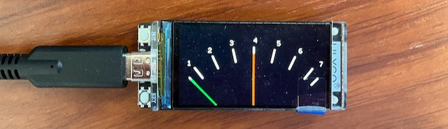

# An i2s Stereo PPM Display



## Current Status

All development takes place on the main branch.

- [x] Decoding i2s data
- [ ] GPIO pins stable
- [x] PPM graphic
- [x] PPM balistics
- [x] i2s + PPM together
- [ ] Optimised

The current version works in MASTER mode at 48kHz when connected to an Analogue to i2s Convertor. Example:

<https://www.audiophonics.fr/en/devices-hifi-audio-adc/stereo-adc-board-wm8782-i2s-24bit-192khz-p-14897.html>

Other convertors, which operate in SLAVE mode, may also work.

## Hardware

LilyGo T-Display-S3 (H569) with 1.9 inch ST7789 LCD Display. Model H569 does not have a touch screen and this is important.  A touch screen version will not work!

<https://www.lilygo.cc/products/t-display-s3?variant=42284559827125>

Any "Standard/Philips" i2s input device, such as a TOSLINK, S/PDIF or Analogue to i2s convertor operating at 48kHz 16bit.

## Pin Connections

The i2s specification omits to provide a standard for the bus names.

The test ADC device solder pads are labeled B, LR, D and CLK, as follows:

```
B       Bit clock       BCK, SCK, BCLK, etc.
LR      Word clock      WS, LRCLK, FS, etc.
D       Serial data     DATA, SD, SDATA, SDIN, SDOUT, DACDAT, ADCDAT, etc.
CLK     Master clock    MCK, etc. 
```

For current connections see the i2s_Input.hpp source code.

## Calibration

Adjust the analog input level so that PPM 4 lines up with a -18dB Full Scale 1kHz Sinewave source.

Note: max input is 1 volt rms, so a simple adjustable gain pre-amp may be required.

## Development Environmet

VSCode with the PlatformIO extension.

```
Edit file: 
    .pio/libdeps/lilyg0-t-display-s3/TFT_eSPI/User_Setup_Sketch.h

Comment out line:
    #include <User_Setup.h>

Uncomment line:
    #include <User_Setups/Setup206_LilyGo_T_Display_S3.h>
```
And according to https://github.com/Bodmer/TFT_eSPI/discussions/2608#discussioncomment-5932379
```
Edit file:
    .pio/libdeps/lilyg0-t-display-s3/TFT_eSPI/User_Setups/Setup206_LilyGo_T_Display_S3.h

Add line:
    #define TFT_CS 6
```
But remember to make these alterations after running the "Clean All" command.

## PPM Specification

IEC 60268-10 Type IIa

Scale marks: 1, 2, 3, 4, 5, 6, 7

PPM 4: corresponds to -18dB FS sinewave

```
                           PPM
scale     1     2     3     4     5     6     7
marks  |  |     |     |     |     |     |     |  |
dB FS    -30   -26   -22   -18   -14   -10   -6
dB steps     4     4     4     4     4     4
usefull range              24db   
```

Integration time (−2 dB): 10 ms

Return time: 24 dB in 2.8 ±0.3 seconds

## License

Copyright (c) 2023 Michael Naylor EA7KIR (https://michaelnaylor.es)

This program is free software: you can redistribute it and/or modify it under the terms of the GNU General Public License as published by the Free Software Foundation, either version 3 of the License, or (at your option) any later version.

This program is distributed in the hope that it will be useful, but WITHOUT ANY WARRANTY; without even the implied warranty of MERCHANTABILITY or FITNESS FOR A PARTICULAR PURPOSE. See the GNU General Public License for more details.

You should have received a copy of the GNU General Public License along with this program. If not, see https://www.gnu.org/licenses/.